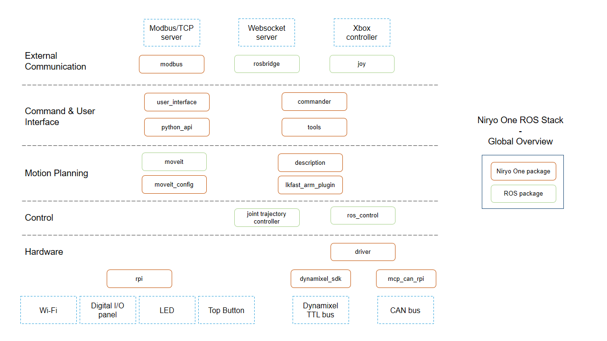

# MedEng_project_G7
This project is a result of the project course in medical engineering at KTH.

This [video][9] shows how the robot is controlled by an EMG signal. \
The [final short paper][10] gives a detailed overview of the project work.

You need to install all the packages from the requirements.txt as well as the ones in the dependencies folder. This can be done manually or with the bash or batch skrips install_packages_... A venv is recommended. If this is a new concept to you watch the video by Corey Shaefer for [unix][1] or [windows][2] respectively. What IDE you use is up to you, we wored with PyCharm.

Installation process for unix:
1) clone repository to a local path
2) create a venv if desired (recommended)
3) make the install_packages_unix.sh executable: `chmod +x install_packages.sh`
4) run the bash skript with: `sh install_packages_unix.sh`

Installation process for windows:
1) clone repository to a local path
2) create a venv if desired (recommended)
3) install all the packages from the requirements.txt `pip install -r requirements.txt`
4) install the niryo one package as follows `pip install -e ./dependencies/niryo_one_tcp_client_package`

## Niryo One
The Niryo One Robot is run with Robot Operating System (ROS) can be operated via different communication channels. The easiest way to get stared is to [download][3] the desktop application. Here you can connect to the robot and get a quick overview of the features.

To communicate with the robot a more sophisticated method is needed. The Niryo provides several layers of abstraction in which you can interact. It provides a python API which can be used to conrol the robot without interacting with ROS. It is an efficient way as ROS is more complex and most of the complexity is not needed. The documentation for the python API can be found [here][4].

An overview of the levels of abstraction can be found on the [github page][5] of the Niryo One ROS stack

There are three main ways that are relevant to us:
1) [Modbus][6] via TCP/IP server
2) send commands of the python API via TCP server
3) use [rosbridge][7] for communication

While Modbus is easy to setup it is also limiting and not sufficient for this project. The rosbridge gives you all the flexibility but is complex to setup. We therefore chose to send commands via TCP that are interpreted by the python API. All the possible commands are listed in the [documentation][4].

## OpenBCI
To acquire the data from the electrodes the OpenBCI Ganglion board is used. Its connection is established via Bluetooth low-energy (BLE). The black dongle should be used and plugged into a USB typ-A port.
The OpenBCI GUI should be [downloaded][8] and installed.

If you open the application you select GANGLION(live) from the System Control Panel and pick the bluetooth transfer protocol. Start to search for the dongle. When found select it, raise the time limit to "no limit" and click start session. Now data from the oBCI board should be transmitted. Make sure to plug in the electrodes in the correct way, according to which channel you want to use.

The OpenBCI GUI communicates with the python code via lab streaming layer (LSL). To set up a stream follow the steps:
1) Go to the networking panel and select "LSL" in the dropdown menu
2) Select the "time series" data as the data to be streamed
3) change the name of the stream to "EMG"
4) turn on the filters that are applied (Notch 50Hz, Bandpass 5-50kHz; make sure to select these in the top of the GUI as well)
5) start the stream as well as the transmission of the data from the ganglion

## Structure of the Code

The code is structured in three main folders:
1) dependencies
2) src (source code)
3) test

The dependencies include the Niryo one packages that you built with pip in the beginning. The src folder is where the running code is located. The Test folder is a collection of all previous code that was used to test features. It is sub structured but no longer relevant for this project.

In the scr folder the main.py is the most important file. Simply execute the run and the program works (when the Niryo and the OpenBCI and connected). Furthermore the folder is structured in code related to the OpenBCI (oBCI_prc) and the code needed for the processing of the data and communication with the Niryo (niryo_prc).

The data is fetched from the LSL stream that is provided by the oBCI GUI and put into a circular buffer. From there the processing begins. An RMS and exponential moving average in combination with a threshold are used to detect a muscle activation. Depending on the duration of the activation of the muscle the Niryo robot is moved in the corresponding direction.

[1]:	https://youtu.be/Kg1Yvry_Ydk
[2]:	https://youtu.be/APOPm01BVrk
[3]:	https://niryo.com/download/
[4]:	https://github.com/NiryoRobotics/niryo_one_ros/tree/master/niryo_one_python_api
[5]:	https://github.com/NiryoRobotics/niryo_one_ros
[6]:    https://github.com/NiryoRobotics/niryo_one_ros/tree/master/niryo_one_modbus
[7]:    http://wiki.ros.org/rosbridge_suite
[8]:    https://openbci.com/downloads
[9]:    ./documents/IMG_1879.MOV
[10]:   ./documents/Medical_Engineering_Project_Paper.pdf
